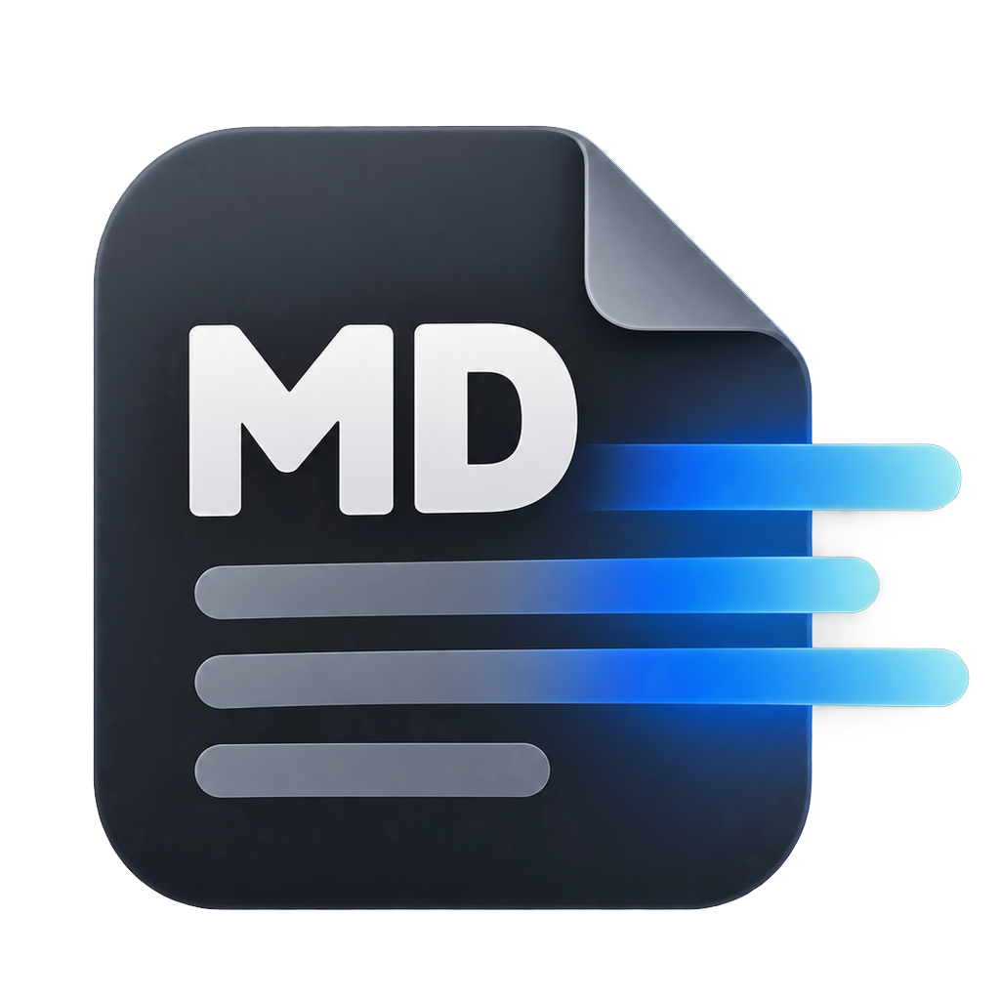

<div align="center">
  
  <h1>MDView</h1>
  <p><b>macOS 上轻量的 Markdown 阅读器</b><br>双击 <code>.md</code> 即读——完全离线、零运行时依赖、不弹授权</p>
  <p>Apple 芯片 · macOS 13+ · GPL-3.0</p>
</div>

---

## 为什么做它

macOS 自带的 Quick Look 不渲染 Markdown：按空格只看到原始文本，Finder 的预览窗格更会退化成一张缩略图。市面上常见的做法是装一个「快速查看扩展」（如 QLMarkdown），但有两个绕不开的代价：

1. **窗格与空格不可兼得**——只要有一个 appex 预览扩展声明了 `.md`，Finder 的检查器窗格就不再回退到系统文本预览，而 appex 的视图又渲染不到窗格里，最终显示一张缩小的页面图；
2. **双击打开仍要另找编辑器**——预览扩展不是阅读器，不能当默认打开程序。

于是就有了 MDView：一个**双击即读**的独立阅读器，**不依赖任何 Quick Look 预览扩展**，也不启动任何子进程。

## 特性

| 能力 | 说明 |
| --- | --- |
| Markdown 渲染 | GFM：表格、任务列表、脚注、自动链接、删除线等（markdown-it） |
| 代码高亮 | highlight.js（GitHub 明/暗主题，随外观切换） |
| 公式 | LaTeX，MathJax 3 **SVG 输出**——不需要外挂字体文件，离线可用 |
| 图表 | Mermaid 11，` ```mermaid ` 代码块直接出图 |
| 外观 | 明暗自适应（`prefers-color-scheme`），跟随系统 |
| 交互 | 单窗口承载**多个文件**，`←/→` 切换（带防抖）；`⌘F` 查找；`⌘L` 钉住；**失焦即关**；`Esc` 关闭 |
| 体验 | 文件被外部修改**自动重载**；窗口位置记忆；触控板缩放 |
| 干净 | **不联网、不启动子进程、不索要「访问其他 App 的数据」授权** |
| 体积 | App 约 7 MB；MathJax/Mermaid 只在文档确实用到时才加载 |

## 安装

### 方式一：下载 DMG（推荐）

1. 到 [Releases](https://github.com/siagfried/MDView/releases) 下载最新的 `MDView-x.y.z.dmg`
2. 打开 DMG，把 **MDView.app** 拖进「应用程序」
3. **首次打开**：在「应用程序」里对着 MDView.app **右键 → 打开 → 再点「打开」**

   > 本项目未做 Apple 公证（需付费开发者账号），所以首次会被 Gatekeeper 拦一次。
   > 如果连右键打开也被拒：**系统设置 → 隐私与安全性 → 找到 MDView → 点「仍要打开」**。只需一次。
4. 想让它接管 `.md` 双击：运行 DMG 里的 **`首次打开助手.command`**（右键 → 打开），它会自动解除隔离并把 `.md` 关联到 MDView。
   手动做法：右键任一 `.md` → 显示简介 → 打开方式选 MDView → **更改全部…**

### 方式二：从源码构建

```sh
git clone https://github.com/siagfried/MDView.git
cd MDView
./build.sh                       # 生成 MDView.app（ad-hoc 签名）
./build.sh --sign "证书名称"      # 也可用自签/开发者证书签名
open MDView.app
```

需要 Xcode Command Line Tools：`xcode-select --install`。构建时会从 CDN 拉取前端库（版本锁定，见 `build.sh`）。

## 快捷键

| 操作 | 说明 |
| --- | --- |
| 双击 `.md` | 打开（多选后双击＝同一窗口打开多个） |
| `←` / `→` | 在多文件之间切换（长按不会连跳） |
| `⌘F` | 查找；`⌘G` / `⇧⌘G` 下一个 / 上一个；`Esc` 收起查找条 |
| `⌘L` | 钉住窗口：默认**失焦即关**，钉住后保留（此时自动重载才有意义） |
| `Esc` | 关闭窗口 |
| `⌘R` | 重新载入 |
| `⌘+` / `⌘−` / `⌘0` | 放大 / 缩小 / 实际大小（触控板双指缩放同样可用） |
| `⌘C` / `⌘A` | 拷贝选中文字 / 全选 |
| `⌘O` / `⌘W` / `⌘Q` | 打开 / 关窗 / 退出 |

## 渲染效果


*同一套资源在无头 Chrome 中的离线验证截图：行内/块级公式、Mermaid 流程图、表格、代码高亮。*

## 实现要点（踩坑记录）

这些是实际调试出来的结论，供后来者少走弯路：

1. **渲染全程在进程内**：`WKWebView` + markdown-it + highlight.js，样式沿用 QLMarkdown 的 `default.css`。不启动任何子进程。
2. **为什么不能用现成的 CLI 渲染器**：早期版本调用 QLMarkdown 自带的 `qlmarkdown_cli` 产出 HTML，结果 macOS 把「App 运行**非自身 bundle** 的助手可执行文件」视作访问外部代码，触发 `kTCCServiceSystemPolicyAppData`（"想访问其他 App 的数据"）授权；更麻烦的是**该授权无法对非 bundle 二进制持久化**——即使用户点过「允许」、授权行也写入了 TCC.db，**每次打开仍会再问**（改签为自有证书亦无效）。改为进程内渲染后，弹窗彻底消失。
3. **想要授权长期有效，签名身份必须稳定**：ad-hoc 签名每次重建都会改变 cdhash，TCC 已存授权随即失配（日志里的 `Failed to match existing code requirement`）。本地开发建议用固定自签证书签名。
4. **中文排版陷阱**：行距取"默认"（等价 `1.0`）时，中文回退字形的行框比拉丁字体高，逐行压叠；需显式设置行距（本项目的样式已处理）。
5. **Finder 窗格只吃缩略图**：只要有任何 appex 预览扩展声明 `.md`，检查器窗格就显示页面图而非实时预览——这是设计取舍，不是 bug（参见 QLMarkdown issue #186 / #191）。

## 已知限制

- 仅 **arm64**（Apple 芯片）；Intel Mac 请自行用 `swiftc -target x86_64-apple-macos13.0` 编译
- 要求 **macOS 13** 及以上
- **未做 Apple 公证**，首次打开需手动放行一次
- 纯阅读器，不含编辑功能

## 许可

本项目以 **GPL-3.0** 发布 —— 因为打包了 QLMarkdown 的 `default.css`（GPL-3.0）。第三方组件与完整许可说明见 [THIRD-PARTY.md](THIRD-PARTY.md)。

## 致谢

- [QLMarkdown](https://github.com/sbarex/QLMarkdown)（sbarex）—— 样式表 `default.css` 与「用 Quick Look 看 Markdown」的先行实践
- [markdown-it](https://github.com/markdown-it/markdown-it) · [highlight.js](https://highlightjs.org/) · [MathJax](https://www.mathjax.org/) · [mermaid](https://mermaid.js.org/)

---

## English

**MDView** is a lightweight, fully-offline Markdown **reader** for macOS (Apple silicon, macOS 13+).

Double-click a `.md` file and read it rendered — GFM tables, syntax-highlighted code (highlight.js), LaTeX math (MathJax, SVG output) and Mermaid diagrams. Multiple files open in one window with `←/→` navigation; `⌘F` to search; `⌘L` to pin (by default the window closes when it loses focus, Quick-Look style).

It does **not** use Quick Look preview extensions and spawns **no subprocesses**, so macOS never asks for *"access data from other apps"* — a limitation that made child-process rendering unusable in earlier iterations.

Install: grab the DMG from Releases, drag to `/Applications`, then **right-click → Open** the first time (the app is not notarized). Build from source with `./build.sh`.

Licensed under **GPL-3.0** (the bundled `default.css` comes from QLMarkdown, which is GPL-3.0). See [THIRD-PARTY.md](THIRD-PARTY.md).
